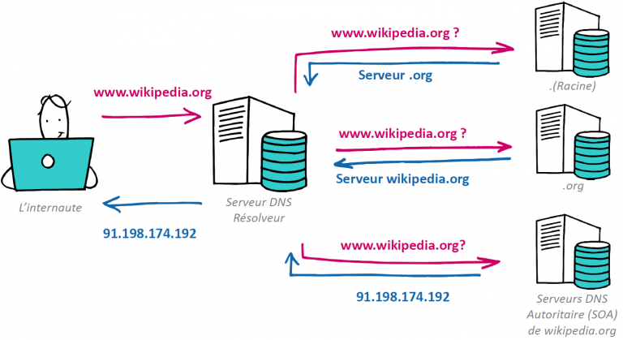

# Généralités

## Bref historique

### 1950s

La conceptualisation

### 1960s 

Les premières mises en oeuvre et avancées 
* Création d'ARPANET (réseau de la défense états-unienne)
* Premiers ordinateurs en réseau 

### 1970s

* Premier email
* Création de Usenet (forums)

### 1980s

* Définition des protocoles 
* Première utilisation du DNS
* Plus de 100 000 d'ordinateurs connectés

### 1990s 

* Création du Web
* Plus de 1 000 000 d'ordinateurs connectés
* Premier navigateur

## Définition des concepts

### Internet

Réseau informatique composé d'une multitude de sous-réseaux qui communiquent entre eux grâce à des protocoles standardisés. 
Transmission d'information permettant l'utilisation des mails, la tenue de visioconférences, le partage de fichiers...

#### DNS

Service permettant de traduire des URL en adresses IP



### Web

Littéralement la toile d'araignée

Une des applications possibles du réseau Internet qui a démocratisé l'accès à Internet

http://www.evolutionoftheweb.com/

Basé sur 3 "inventions" :

#### 1. les URL pour identifier chaque ressource

Uniform Resource Locator - littéralement "Localisateur Uniforme de Ressource"

***Cas concret :*** je fais la recherche "bibliothèques clermont metropole" dans le moteur de recherche Google - je suis sur une page dont l'URL est

```
https://www.google.com/search?q=bibliothèques+clermont+metropole
```

Décomposition :

* Protocole : `https`
* Localisation de la ressource : 
  * Nom de domaine : `www.google.com`
  * Nom de la ressource à demander : `search`
  * Paramètres : `q=bibliothèques+clermont+metropole` données supplémentaires optionnelles introduites par `?` contenant ici spécifiquement la requête faite
* Autres ajouts possibles
  * nom d'utilisateur et mot de passe avant le nom de domaine terminé par `@`
  * un port après le nom de domaine précédé par `:`
  * une ancre introduite par `#`

#### 2. le protocole http pour communiquer entre les machines

hypertext transfer protocol - littéralement "protocole de transfert hypertexte"

base des échanges suivant un modèle client/serveur initié par le client et traité par le serveur qui renvoie un code puis les données

|Code|Significations|
|-|-|
|1XX|Information|
|2XX|Succès|
|3XX|Redirections|
|4XX|Erreur client|
|5XX|Erreur serveur|

##### Exemples

* 200 OK
* 404 Page not found
* 500 Server Internal Error
* 504 Gateway Timeout

***Cas concret :*** je clique sur le lien qui m'intéresse dans les résultats de ma recherche

Requête envoyée par le client :

```
GET	https://www.bibliotheques-clermontmetropole.eu/
```

Réponse envoyée par le serveur :

```
HTTP/1.1 200 OK
Date: Wed, 16 Jun 2021 10:13:33 GMT
Expires: Sun, 19 Nov 1978 05:00:00 GMT
Cache-Control: no-cache, must-revalidate
X-Content-Type-Options: nosniff
Content-Language: fr
X-Frame-Options: SAMEORIGIN
X-UA-Compatible: IE=edge,chrome=1
Link: </content/accueil>; rel="canonical",</node/860>; rel="shortlink"
Vary: Accept-Encoding
Content-Type: text/html; charset=utf-8
Content-Length: 14897
Content-Encoding: gzip
Keep-Alive: timeout=5, max=300
Connection: Keep-Alive
```

#### 3. le langage html pour écrire chaque ressource

hypertext markup language - littéralement langage de balises d'hypertexte

code utilisé pour la structure d'une page et son contenu

language de balisage et non de programmation

technologies adjointes : CSS pour la mise en forme et Javascript

***Cas concret :*** mon navigateur affiche ma page (le document) que j'ai demandé

```html
...
<ul class="menu">
 <li class="first leaf has-children menu-mlid-326">
  <a href="/page/infos-pratiques">Infos pratiques</a>
 </li>
 <li class="leaf menu-mlid-611">
  <a href="/page/ressources-en-ligne-0">Ressources</a>
 </li>
 <li class="leaf menu-mlid-1687">
  <a href="https://www.bibliotheques-clermontmetropole.eu/s/search.php" title="recherche documentaire">CATALOGUE</a>
 </li>
 <li class="last leaf has-children menu-mlid-1987">
  <a href="/page/overnia-bibliotheque-numerique-patrimoine" title="Bibliothèque numérique du patrimoine">PATRIMOINE</a>
 </li>
</ul>
...
```

Un extrait du document reçu : ici c'est le menu "Infos pratiques / Ressources / CATALOGUE / PATRIMOINE", en html on a simplement une liste de liens
 

#### Page Web

Pas de définition technique particulière ; **document** possible de consulter sur le web (avec un navigateur) auquel on accède via son adresse web (URL)

#### Site web

Ensemble de pages web 

### Serveur 

Logiciel permettant de fournir (servir) des ressources via un protocole défini.
Par extension désigne aussi la machine hébergeant le logiciel.

### Client 

Logiciel permettant de requêter puis de recevoir les ressources.
Un navigateur est un type de client http
Comprend le html, css et js

## En gros

* Internet = réseau de tuyaux & Web = une partie du contenu circulant dans les tuyaux
* http = transport de l'information & html = contenu de la page (information structurée)
* ip = adresse de la machine & url = adresse de la ressource
* client = poste utilisateur & serveur = fournisseur de ressources
