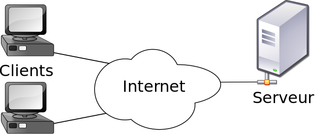

## Fonctionnement

### Architecture

#### http

1. Ouverture de la connexion
2. Envoi de la requête par le client
3. Traitement de la requête par le serveur & envoi du code et de "paquets"
4. Réception de la requête par le client
5. Fermeture de la connexion

cookies

##### https

hypertext transfer protocol secure

### Langages

#### html

#### css

css garden

#### js

#### Serveurs

##### Scripts

##### Base de données

# Sécurité

## Attaques

## Phishing récent à CAM

Données personnelles

# Cas pratique : le nouveau SIGB

